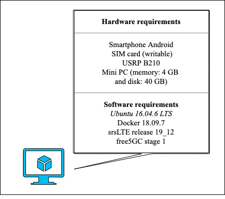

# IEEE NetSoft2020-Tutorial4-Demo1-Exp3

This experiment aims to demonstrate the deployment of a mobile network based on hardware and software, integrating a 4G RAN and a 5G Core with the Service-Based Architecture (SBA), as illustrated by the following image.
<p align="center">
     
</p>

In this experiment, RAN is deployed with the [Software Radio Systems LTE](https://github.com/srsLTE/srsLTE) project, i.e., LTE. The Core is implemented using the [free5GC](https://www.free5gc.org/) project. This experiment's main goal is to demonstrate a connection between UE in hardware (conventional cell phone), 4G RAN in hardware (SDR - Software-Defined Radio) and software, and 5G SBA core implemented in software.

The minimum hardware requirement and software to run this experiment is shown in the image below.
<p align="center">
     
</p>
For this experiment, we assume that the machine has full access to the Internet.

# 1 - Installation tools
We need two tools to run this experiment, _Git_ and _Docker_

To install _Git_, run the following command:
```
$ sudo apt-get install git-all
```

To install _Docker_, run the following commands:
```
$ sudo apt-get update
$ sudo apt-get install docker-ce docker-ce-cli containerd.io
```

 After, we can clone the **NetSoft2020-Tutorial4-Demo2-Exp2 project**:
```
$ git clone https://github.com/LABORA-INF-UFG/NetSoft2020-Tutorial4-Demo2-Exp2.git
```

# 2 - Build the images and running the containers

To build the eNB and all 5GC images, use the following command:  
```
$ sudo docker build -t netsoft2020tutorial4demo2exp2 .
```

We can check if the images are up:
```
$ sudo docker image ls
```
The output should be similar to the following:
<p align="center">
     
</p>

To run the containers, use the following command:
```
$ sudo docker-compose up -d
```

We can check if the containers are up:
```
$ sudo docker-compose ps
```
The output should be similar to the following:
<p align="center">
     
</p>

Done! The software is successfully installed.
