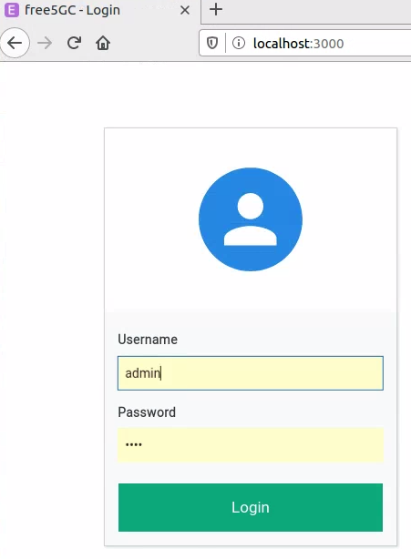
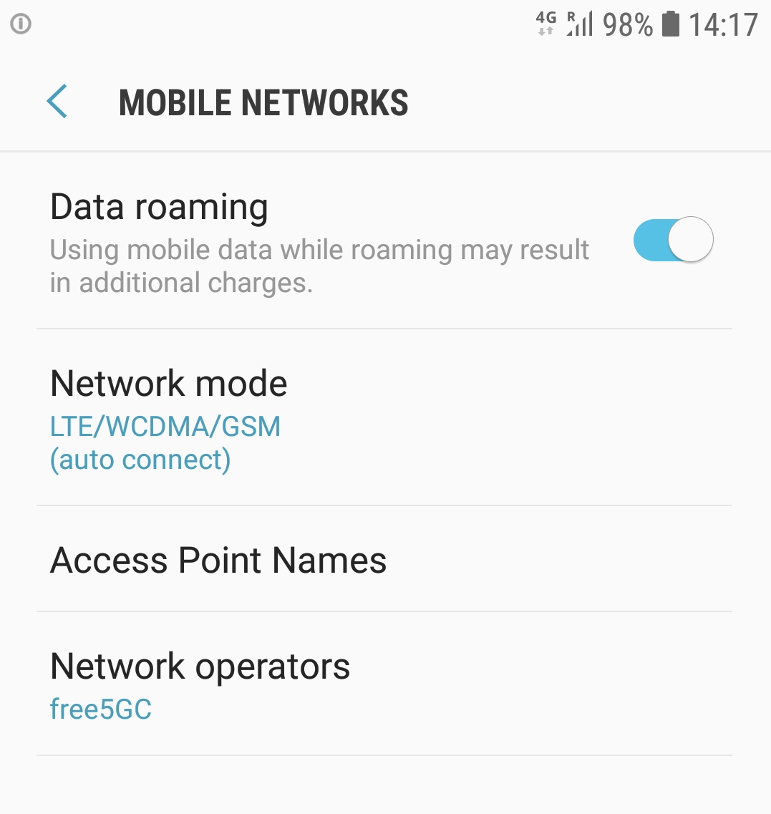

# IEEE NetSoft2020-Tutorial4-Demo1-Exp3

This experiment aims to demonstrate the deployment of a mobile network based on hardware and software, integrating a 4G RAN and a 5G Core with the Service-Based Architecture (SBA), as illustrated by the following image. This experiment's main goal is to demonstrate a connection between UE in hardware (conventional cell phone), 4G RAN in hardware (SDR - Software-Defined Radio) and software, and 5G SBA core implemented in software.
<p align="center">
     
</p>

 ## Installation

**Requirements**

The minimum hardware requirement and software to run this experiment is shown in the image below.
* Smartphone Android
* SIM card (writable)
* USRP B210
* Mini PC (RAM: 4GB and disk space: 40GB)
* Ubuntu 16.04 LTS
* Docker 18.09.7
* srsLTE release 19_12
* free5GC stage 1

**Steps**

We need two tools to run this experiment, _Git_ and _Docker_

To install _Git_, run the following command:
```
$ sudo apt-get install git-all
```

To install _Docker_, run the following commands:
```
$ sudo apt-get update
$ sudo apt-get install docker-ce docker-ce-cli containerd.io
```

 After, we can clone the **NetSoft2020-Tutorial4-Demo2-Exp2 project**:
```
$ git clone https://github.com/LABORA-INF-UFG/NetSoft2020-Tutorial4-Demo2-Exp2.git
```

# Build the images and running the containers

To build the eNB and all 5GC images, use the following command:  
```
$ sudo docker build -t netsoft2020tutorial4demo2exp2 .
```

We can check if the images are up:
```
$ sudo docker image ls
```
The output should be similar to the following:
<p align="center">
     
</p>

To run the containers, use the following command:
```
$ sudo docker-compose up -d
```

We can check if the containers are up:
```
$ sudo docker-compose ps
```
The output should be similar to the following:
<p align="center">
     
</p>


# Show the experiment

The first step of the experiment is to store in HSS the UE's information using the Web Interface of the free5GC project.
<p align="center">
     
     
</p>


We use the [openSTF](https://openstf.io/) tool to access the smartphone remotely.
This software is available at http://localhost:7100, as is shown in the image below.
<p align="center">
     
</p>

We can see the smartphone connected in the network called free5GC available. 
<p align="center">
     
</p>

We use the [PingTools Network Utilities](https://play.google.com/store/apps/details?id=ua.com.streamsoft.pingtools&hl=pt_BR) tool available at GooglePlay to test the connectivity of the network.
<p align="center">
     
     
</p>

Finally, we can use any app, for example see a video. 
<p align="center">
     
</p>

# Additional comments

The SIM card used is of [sysmocom](https://www.sysmocom.de/index.html) with an Android Samsung Galaxy S7 SM-G930F.

SDR is an [Ettus B210](https://www.ettus.com/) with four antennas connected via USB in the mini PC.  

RAN is deployed with the [Software Radio Systems LTE](https://github.com/srsLTE/srsLTE) project.

The Core is implemented using the [free5GC](https://www.free5gc.org/) project.
